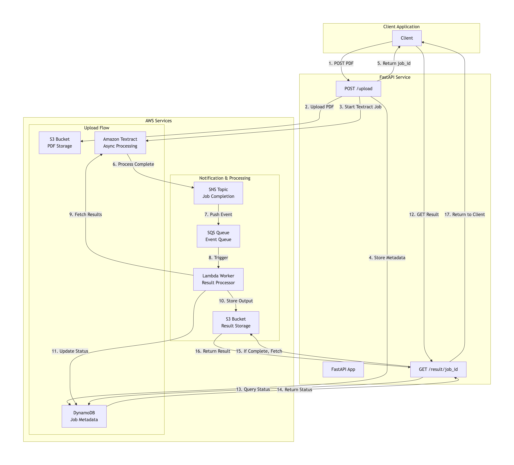

# textract-llm-agent
Textract LLM agent system 

1. api-service-textract
2. worker-lambda-textract
3. agent-service


# Application Flow





```

Client
  |
  | POST /upload
  v
FastAPI Service
  |
  |-- Upload PDF to S3
  |-- Start Textract Async Job
  |-- Store job metadata
  |
  |--> Return job_id
--------------------------------------------------
Textract
  |
  | Job Completion Event
  v
SNS
  |
  v
SQS
  |
  v
Lambda Worker
  |
  |-- Fetch Textract results
  |-- Store output in S3
  |-- Update job status
--------------------------------------------------
Client
  |
  | GET /result/{job_id}
  v
FastAPI Service → DynamoDB → S3


```